[](https://github.com/samdouble/fikasio-react-ui-components/actions/workflows/checks.yml?branch=master)
[](https://coveralls.io/github/samdouble/fikasio-react-ui-components?branch=master)
[](https://badge.socket.dev/npm/package/@fikasio/react-ui-components/latest)

[](https://nodejs.org/)
[](https://www.typescriptlang.org/)
[](https://react.dev/)
[](https://jestjs.io/)
[](https://playwright.dev/)
[](https://storybook.js.org/)
[](https://www.npmjs.com/)

# @fikasio/react-ui-components

## Installation

Use **npm**:

```
npm install --save @fikasio/react-ui-components
```

or **Yarn**:

```
yarn add @fikasio/react-ui-components
```

## Usage

Import components from the package in your React application, for example:

```
import { Footer } from '@fikasio/react-ui-components';
```

## Components

### AutosaveTextarea

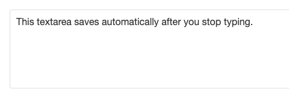

#### Props

| Name                    | Type            | Required        | Description                                     |
|-------------------------|:----------------|:----------------|:------------------------------------------------|
| className               | string          | No              | Additional CSS class name for the textarea      |
| defaultValue            | string          | No              | Initial text content of the textarea            |
| name                    | string          | No              | Name attribute for the textarea input           |
| onSave                  | function        | No              | Handler called when content should be saved     |
| placeholder             | string          | No              | Placeholder text when textarea is empty         |
| style                   | CSSProperties   | No              | Additional CSS styles for the textarea          |
| value                   | string          | No              | Controlled text content value                   |

### Breadcrumb

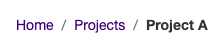

#### Props

| Name                    | Type            | Required        | Description                                     |
|-------------------------|:----------------|:----------------|:------------------------------------------------|
| className               | string          | No              | Additional CSS class name for the Breadcrumb    |
| items                   | array           | No              | Trail items (`label`, optional `href` and `onClick`). The last item is the current page |
| separator               | ReactNode       | No              | Separator rendered between items. Defaults to `/` |
| style                   | CSSProperties   | No              | Additional CSS styles for the Breadcrumb        |

### Button

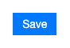

#### Props

| Name                    | Type            | Required        | Description                                     |
|-------------------------|:----------------|:----------------|:------------------------------------------------|
| className               | string          | No             | Additional CSS class name for the button         |
| disabled                | boolean         | No             | Whether the button is disabled                   |
| onClick                 | function        | No             | Handler called when button is clicked            |
| style                   | CSSProperties   | No             | Additional CSS styles for the button             |

### Checkbox

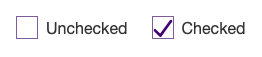

#### Props

| Name                    | Type            | Required        | Description                                     |
|-------------------------|:----------------|:----------------|:------------------------------------------------|
| className               | string          | No             | Additional CSS class name for the checkbox      |
| defaultIsChecked        | boolean         | No             | Initial checked state of the checkbox           |
| isChecked               | boolean         | No             | Controlled checked state of the checkbox        |
| name                    | string          | No             | Name attribute for the checkbox input           |
| onClick                 | function        | No             | Click handler function for the checkbox         |
| style                   | CSSProperties   | No             | Additional CSS styles for the Checkbox          |

### DatePicker

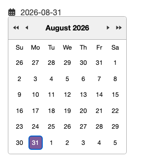

By default the calendar header uses single carets to move by month and double carets to move by year.

#### Props

| Name                    | Type            | Required        | Description                                     |
|-------------------------|:----------------|:----------------|:------------------------------------------------|
| className               | string          | No              | Additional CSS class name for the DatePicker    |
| dateFormat              | string          | No              | Format for date value (e.g. 'yyyy-MM-dd')       |
| defaultValue            | Date            | No              | Initial date value                              |
| displayFormat           | string          | No              | Format for displaying the date                  |
| displayFunction         | function        | No              | Function for displaying the date                |
| isOpen                  | boolean         | No              | Controls whether the picker is open             |
| name                    | string          | No              | Name attribute for the input                    |
| onChange                | function        | No              | Handler called when date selection changes      |
| onClose                 | function        | No              | Handler called when picker closes               |
| onOpen                  | function        | No              | Handler called when picker opens                |
| onRemoveValue           | function        | No              | Handler called when value is cleared            |
| shouldCloseOnSelect     | boolean         | No              | Whether to close picker after selection         |
| showMonthDropdown       | boolean         | No              | Show a month dropdown in the calendar header    |
| showRemoveValue         | boolean         | No              | Show option to clear the selected value         |
| showTimeSelect          | boolean         | No              | Enable time selection                           |
| showYearDropdown        | boolean         | No              | Show a year dropdown instead of the year carets |
| style                   | CSSProperties   | No              | Additional CSS styles for the DatePicker        |
| timeCaption             | string          | No              | Label shown above time selector                 |
| timeFormat              | string          | No              | Format for time value (e.g. 'HH:mm')            |
| timeIntervals           | number          | No              | Interval in minutes between time options        |
| value                   | Date            | No              | Controlled date value                           |

### Dot

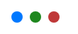

#### Props

| Name                    | Type            | Required        | Description                                     |
|-------------------------|:----------------|:----------------|:------------------------------------------------|
| className               | string          | No              | Additional CSS class name for the Dot           |
| color                   | string          | No              | Color of the dot (any valid CSS color)          |
| size                    | number          | No              | Size of the dot in pixels                       |
| style                   | CSSProperties   | No              | Additional CSS styles for the dot               |

### Error

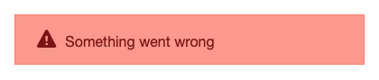

#### Props

| Name                    | Type            | Required        | Description                                     |
|-------------------------|:----------------|:----------------|:------------------------------------------------|
| children                | string/ReactNode| Yes             | Content to display in the error message         |
| className               | string          | No              | Additional CSS class name for the Error         |
| style                   | CSSProperties   | No              | Additional CSS styles for the Error             |

### Footer

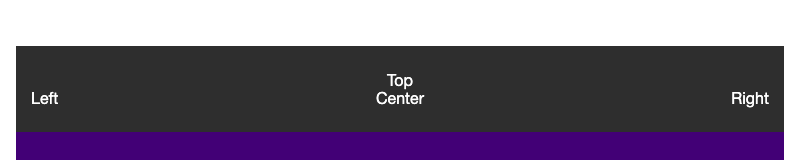

The Footer component provides a flexible layout with multiple sections for content placement. It can contain children elements in the center, left, right, and top positions.

#### Props

| Name                    | Type            | Required        | Description                                     |
|-------------------------|:----------------|:----------------|:------------------------------------------------|
| childrenCenter          | ReactNode       | No              | Content to be displayed in the center section   |
| childrenLeft            | ReactNode       | No              | Content to be displayed in the left section     |
| childrenRight           | ReactNode       | No              | Content to be displayed in the right section    |
| childrenTop             | ReactNode       | No              | Content to be displayed in the top section      |
| className               | string          | No              | Additional CSS class name for the Footer        |
| style                   | CSSProperties   | No              | Additional CSS styles for the Footer            |

### Icon

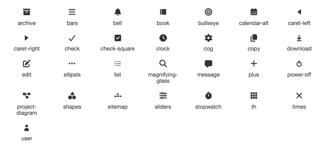

SVG icons rendered with `currentColor` so they inherit the surrounding text color. Use `<Icon name="cog" />`, or import named icons such as `CogIcon` and `UserIcon` directly.

Available names:

- `archive`
- `bars`
- `bell`
- `book`
- `bullseye`
- `calendar-alt`
- `caret-left`
- `caret-right`
- `check`
- `check-square`
- `clock`
- `cog`
- `copy`
- `download`
- `edit`
- `ellipsis`
- `list`
- `magnifying-glass`
- `message`
- `plus`
- `power-off`
- `project-diagram`
- `shapes`
- `sitemap`
- `sliders`
- `stopwatch`
- `th`
- `times`
- `user`

#### Props

| Name                    | Type            | Required        | Description                                     |
|-------------------------|:----------------|:----------------|:------------------------------------------------|
| name                    | string          | Yes             | Icon to render                                  |
| className               | string          | No              | Additional CSS class name for the icon          |
| size                    | `'sm'` \| `'md'` \| `'1x'` \| `'lg'` | No | Icon size. `'md'` is equivalent to `'1x'`. Defaults to `'1x'` |
| style                   | CSSProperties   | No              | Additional CSS styles for the icon              |

### Input

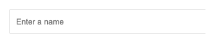

#### Props

| Name                    | Type            | Required        | Description                                     |
|-------------------------|:----------------|:----------------|:------------------------------------------------|
| className               | string          | No              | Additional CSS class name for the Input         |
| defaultValue            | string          | No              | Initial value for uncontrolled input            |
| disabled                | boolean         | No              | Whether the input is disabled                   |
| name                    | string          | No              | Name attribute for the input                    |
| onChange                | function        | No              | Handler called when input value changes         |
| placeholder             | string          | No              | Placeholder text shown when input is empty      |
| style                   | CSSProperties   | No              | Additional CSS styles for the Input             |
| value                   | string          | No              | Controlled input value                          |

### SearchBar

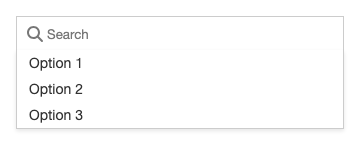

#### Props

| Name                    | Type            | Required        | Description                                     |
|-------------------------|:----------------|:----------------|:------------------------------------------------|
| className               | string          | No              | Additional CSS class name for the SearchBar     |
| defaultValue            | string          | No              | Initial value for uncontrolled input            |
| onChange                | function        | No              | Handler called when input value changes         |
| onSelect                | function        | No              | Handler called when an option is selected from the menu |
| onSubmit                | function        | No              | Handler called when the Enter key is pressed    |
| options                 | array           | No              | Suggestion options that will appear below       |
| placeholder             | string          | No              | Placeholder text when textarea is empty         |
| style                   | CSSProperties   | No              | Additional CSS styles for the SearchBar         |
| value                   | string          | No              | Controlled input value                          |

### Select

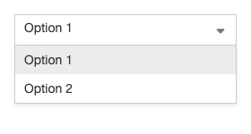

#### Props

| Name                    | Type            | Required        | Description                                     |
|-------------------------|:----------------|:----------------|:------------------------------------------------|
| className               | string          | No              | Additional CSS class name for the Select        |
| defaultValue            | string          | No              | Initial value for uncontrolled select           |
| disabled                | boolean         | No              | Whether the select is disabled                  |
| name                    | string          | No              | Name attribute for the select                   |
| onChange                | function        | No              | Handler called when select value changes        |
| options                 | array           | Yes             | Array of options to display in the select       |
| style                   | CSSProperties   | No              | Additional CSS styles for the Select            |
| value                   | string          | No              | Controlled select value                         |

### Selector

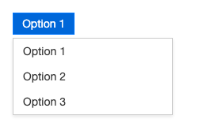

#### Props

| Name                    | Type            | Required        | Description                                     |
|-------------------------|:----------------|:----------------|:------------------------------------------------|
| className               | string          | No              | Additional CSS class name for the Selector      |
| defaultValue            | string          | No              | Initial value for uncontrolled select           |
| name                    | string          | No              | Name attribute for the select                   |
| onChange                | function        | No              | Handler called when select value changes        |
| options                 | array           | No              | Array of options to display in the select       |
| render                  | function        | No              | Describes how to render the main button         |
| style                   | CSSProperties   | No              | Additional CSS styles for the Selector          |
| value                   | string          | No              | Controlled select value                         |

### Success

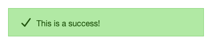

#### Props

| Name                    | Type            | Required        | Description                                     |
|-------------------------|:----------------|:----------------|:------------------------------------------------|
| className               | string          | No              | Additional CSS class name for the Success       |
| style                   | CSSProperties   | No              | Additional CSS styles for the Success           |

### Tabs

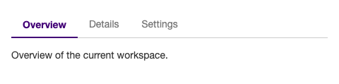

#### Props

| Name                    | Type            | Required        | Description                                     |
|-------------------------|:----------------|:----------------|:------------------------------------------------|
| className               | string          | No              | Additional CSS class name for the Tabs          |
| defaultValue            | string          | No              | Initial value for uncontrolled tabs             |
| onChange                | function        | No              | Handler called when the selected tab changes    |
| options                 | array           | No              | Tabs to display (`label`, `value`, optional `content` and `disabled`) |
| style                   | CSSProperties   | No              | Additional CSS styles for the Tabs              |
| value                   | string          | No              | Controlled selected tab value                   |

### Warning

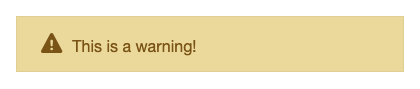

#### Props

| Name                    | Type            | Required        | Description                                     |
|-------------------------|:----------------|:----------------|:------------------------------------------------|
| className               | string          | No              | Additional CSS class name for the Warning       |
| style                   | CSSProperties   | No              | Additional CSS styles for the Warning           |

## Hooks

### useTheme

Reads the current library theme, and optionally sets it. The default is `light`. Allowed values are `light` and `dark`.

Call it near the root of your app to set the theme:

```
import { useTheme, Button } from '@fikasio/react-ui-components';

function App() {
  useTheme('dark');

  return (
    <Button>Save</Button>
  );
}
```

Call it with no argument to read the current theme:

```
const theme = useTheme();
```

#### Parameters

| Name                    | Type            | Required        | Description                                     |
|-------------------------|:----------------|:----------------|:------------------------------------------------|
| newTheme                | string          | No              | Theme to apply (`'light'` or `'dark'`). Invalid values are ignored and log an error |

#### Returns

The current theme: `'light'` or `'dark'`.

## Development

See DEVELOPMENT.md.
